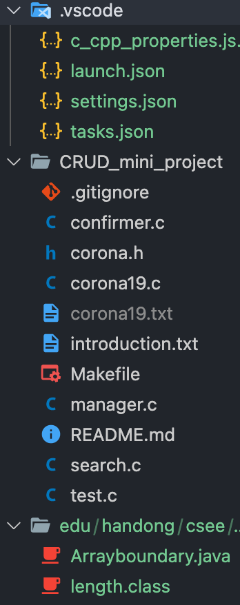
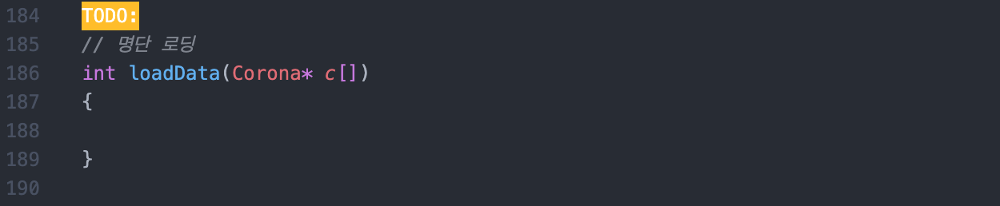
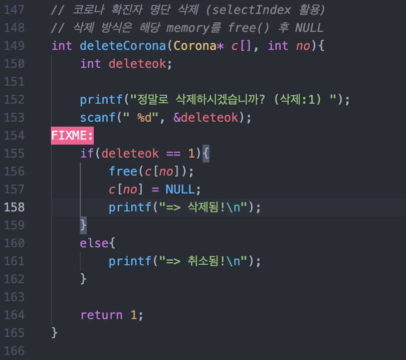
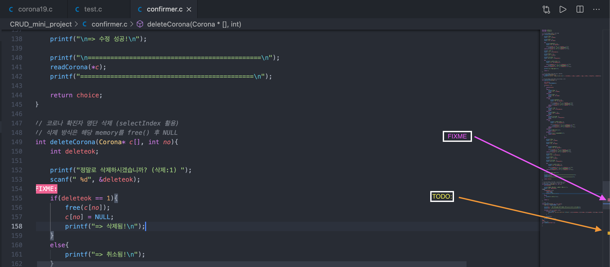
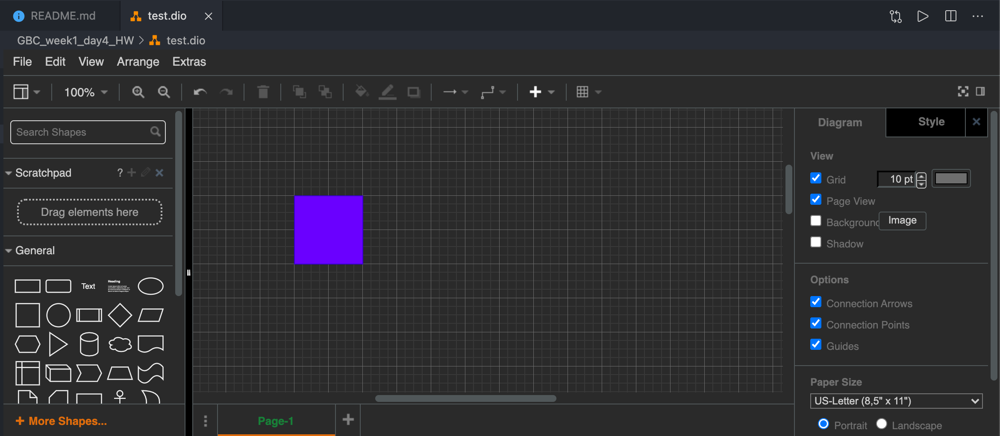

# GBC Day4 Homework: VSCode Extension Marketplace 

---

```Problem
VSCode 확장 마켓 플레이스 에서 학우들과 공유하고 싶은 좋은 확장을 하나 찾아서 
(1) 어떤 확장인지 
(2) 어떻게 사용하는 것인지 
(3) 그래서 얼마나 좋은지를 readme.md 에 설명하여 Github 에 올리기.
```
###### ~~조사해온 확장 프로그램들이 소소한 것 같아서 여러 개 조사했습니다...~~

## 1. Material Icon Theme
- 어떤 확장인가?

    
    - 파일(디렉토리)이 어떤 확장자를 가진 파일인지 아이콘으로 표시해주어 한 눈에 알알아보기 쉽게 해주는 유용한 확장 프로그램 
- 어떻게 사용하는가?
    - VSCode Extension Marketplace에서 [Material Icon Theme](https://marketplace.visualstudio.com/items?itemName=PKief.material-icon-theme) 입력 후 설치. 
- 그래서 얼마나 좋은가?
    - 파일이 많을 때 파일들이 각각 어떤 확장자를 가졌는지 쉽게 알아볼 수 있다.

## 2. TODO Highlights
- 어떤 확장인가?
    
    
    
    - 해야할 것에는 `TODO태그` 를, 고쳐야할 것에는 `FIXME태그`를 달아서 무엇을 해야 햐고 고쳐야 하는지 한 눈에 쉽게 알아보도록 도와주는 확장 프로그램  
- 어떻게 사용하는가?
    - VSCode Extension Marketplace에서 [TODO Highlight](https://marketplace.visualstudio.com/items?itemName=wayou.vscode-todo-highlight) 입력 후 설치.
    - 해야할 것에 `TODO:`, 고쳐야할 것에 `FIXME:` 작성
    - 편집기 명령 (<kbd>ctrl</kbd> + <kbd>shift</kbd> + <kbd>p</kbd>) 에서 `Toggle highlight`을 입력하여 태그를 on/off 할 수 있다.
- 그래서 얼마나 좋은가?
    - 태그를 통해 해야할 것과 고쳐야할 것을 한 눈에 알아볼 수 있다.

    

## 3. Draw.io Integration
- 어떤 확장인가?
    - VSCode에서 draw.io를 할 수 있게 지원해주는 확장 프로그램
- 어떻게 사용하는가?
    - VSCode Extension Marketplace에서 [Draw.io Integration](https://marketplace.visualstudio.com/items?itemName=hediet.vscode-drawio) 입력후 설치
    - draw.io 파일로 작성하기 위해서 .drawio 나 .dio 확장자의 파일 생성 
    
- 그래서 얼마나 좋은가?
    - 다양한 분야에서 도움을 주는 draw.io를 vscode에서 간편하게 작성할 수 있고 local로 저장할 수 있어서 편리하다.
